# Installation of Windows Server

Environment:
- Windows Server 2022 ISO - [link](https://www.microsoft.com/en-us/evalcenter/evaluate-windows-server-2022)
- Mac Os 26.3.1 with M4 Mac
- UTM - virtualizer of Windows Server - [link](https://mac.getutm.app/)

UTM has to be used because of M4 Apple chip (emulation of x86_64 architecture) - Win/Linux machines can use different virtualizers


## Virtualization settings

Following are steps of creating virtualized Windows Server 2022 with UTM virtualizer

1. On Mac OS select emulation
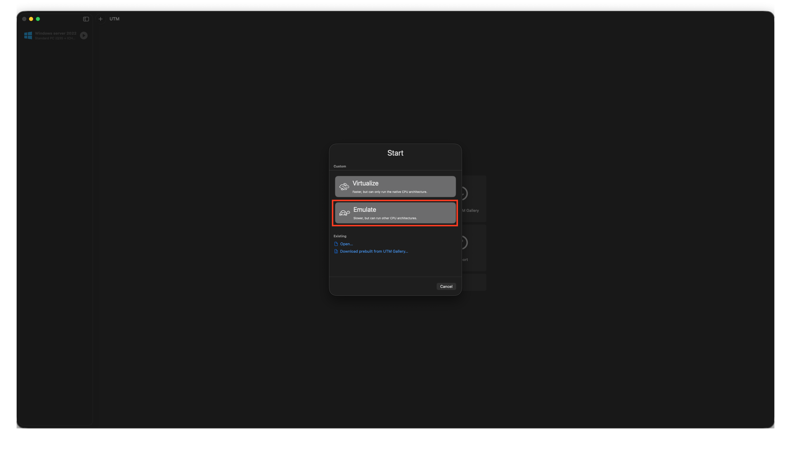

2. OS selection
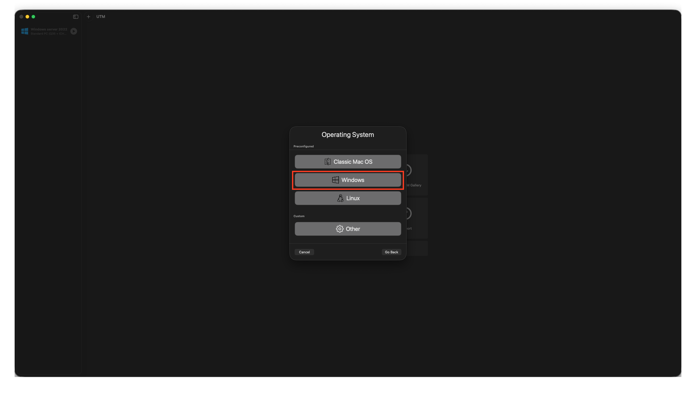

3. Hardware settings
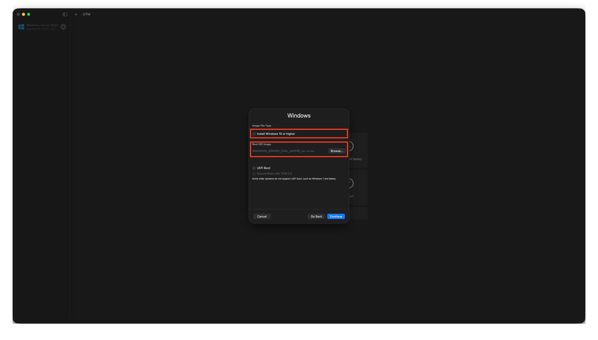

4. Windows settings
Use provided ISO from [Google drive]()


5. Storage settings
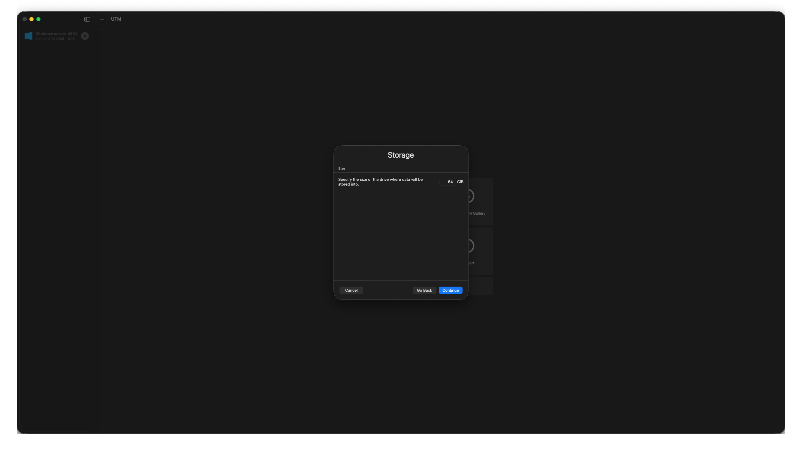

6. Shared directory settings


7. Summary settings
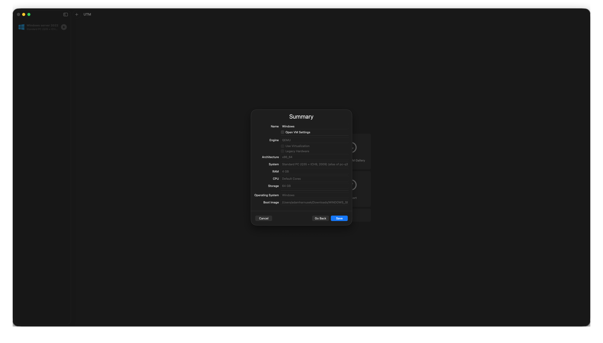


## Windows Server installation

Start virtualization and click trought Windows Server installation (can take several minutes). Follow those steps:

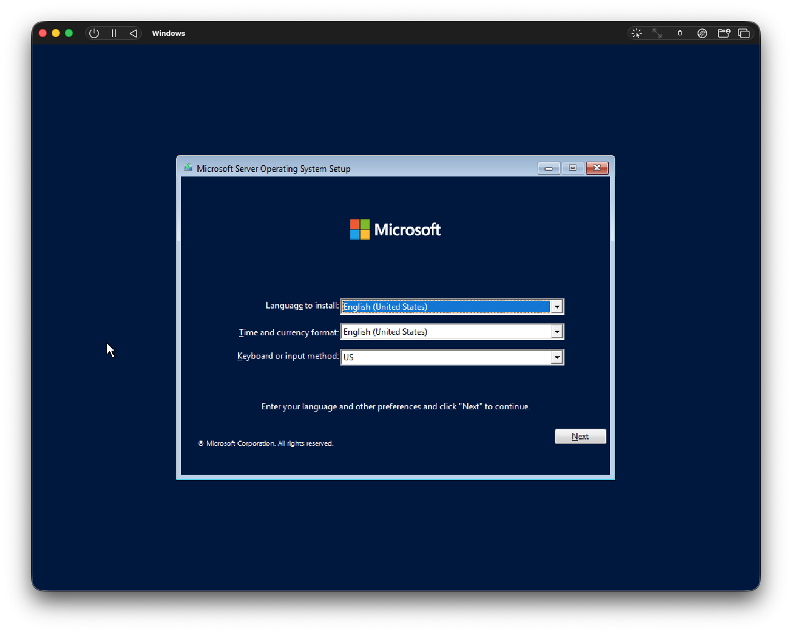
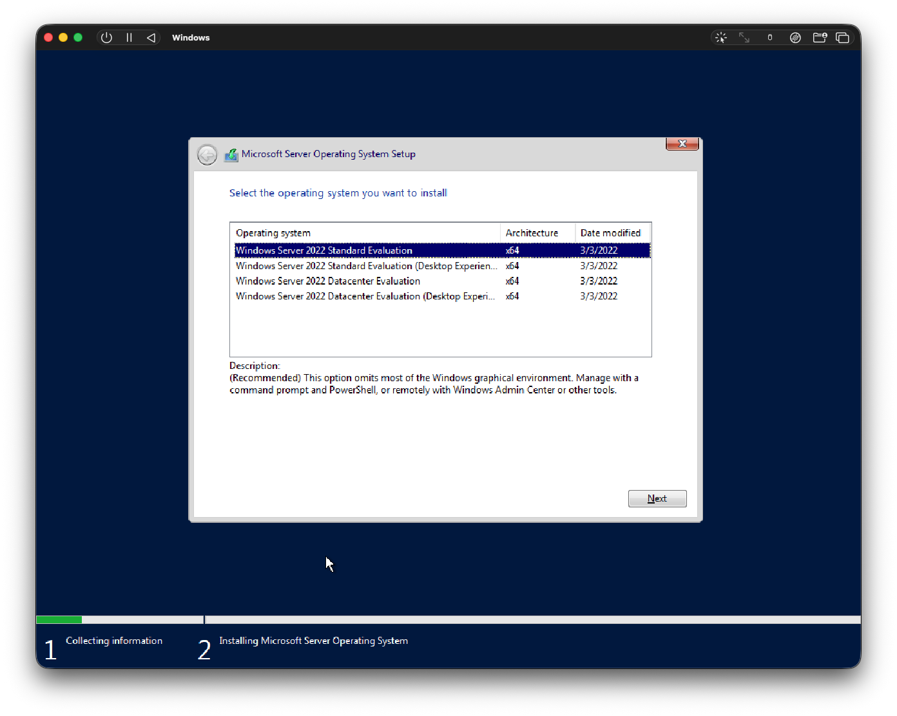
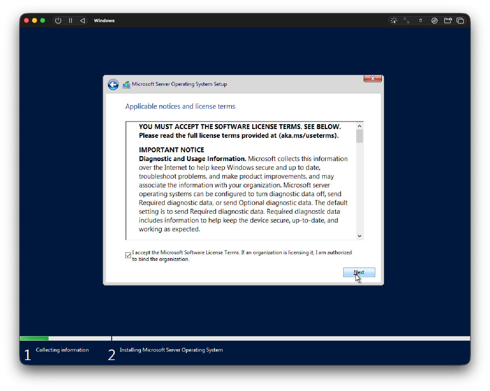
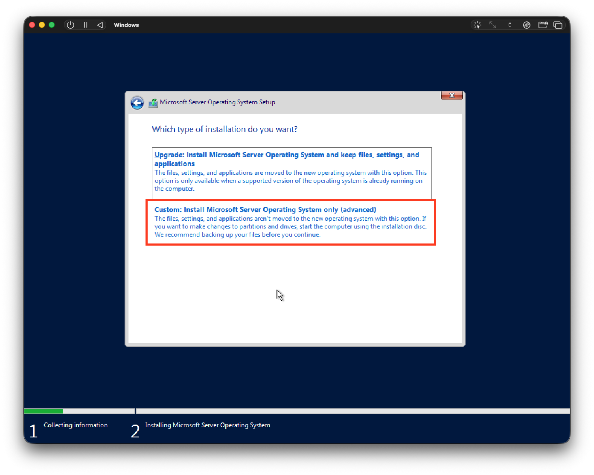
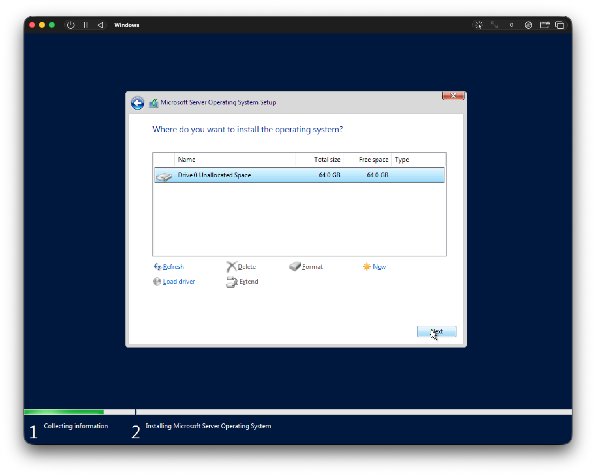
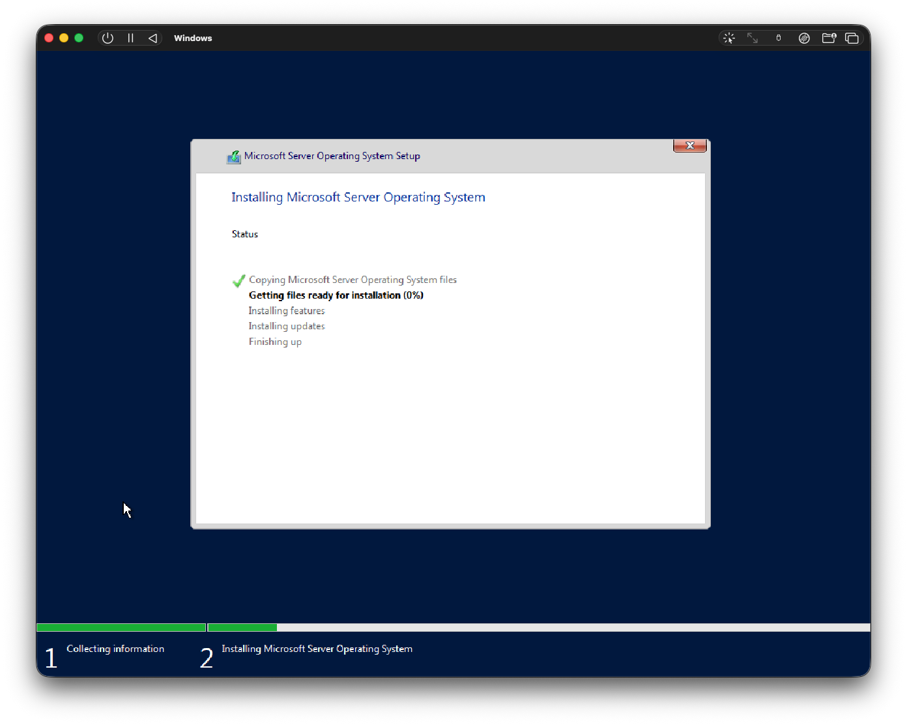


After you are in login screen it can be fairy difficult to add password. For Mac and UTM virtualizer it is Fn + Control + Option + Backspace.

## Shared directory

To run `.dll` inside Windows Server we need to create shared directory and than load this `.dll` from there inside Windows Server.
Make sure that share directory has **read and write** permissions from windows side. Because building `.dll` inside Windows Server requires write operations.

TODO: Document process of creating Shared Directory in UTM


## CMake

Installation of CMake on Windows server ([v3.30.1](https://github.com/Kitware/CMake/releases/tag/v3.30.1)). Download `.msi` file and install. 

## Visual Studio build tools

Needed for CMake generator [link](https://learn.microsoft.com/en-us/visualstudio/releases/2022/release-history#evergreen-bootstrappers)

Check `Desktop development with C++` and make sure `C++ CMake tools for Windows` is selected and install.

## Initialize MSVC build tools

We need to initialize them before each run of `powershell`. Ideal case for creating `$PROFILE`. Check if file exists. If not create one.

Check if exists
```powershell
Test-Path $PROFILE
```

Create file
```powershell
New-Item -ItemType File -Path $PROFILE -Force
```

Edit file and add initialization of MSVC
```powershell
notepad $PROFILE

$vswhere = "${env:ProgramFiles(x86)}\Microsoft Visual Studio\Installer\vswhere.exe"
$vsPath = (& $vswhere -latest -products * -requires Microsoft.VisualStudio.Component.VC.Tools.x86.x64 -property installationPath).Trim()
Import-Module "$vsPath\Common7\Tools\Microsoft.VisualStudio.DevShell.dll"
Enter-VsDevShell -VsInstallPath $vsPath -SkipAutomaticLocation -DevCmdArguments "-arch=x64"
```
> This can easily slow down initialization by 10+ seconds

## Install Choco (Win package manager)

```powershell
iex ((New-Object System.Net.WebClient).DownloadString('https://community.chocolatey.org/install.ps1'))
```

## Install Just command runner

```powershell
choco install just
```

## Install git

```powershell
choco install git
```
If `git` command is not accesible try refresh env with `refreshenv` command

## Install dotnet

Install dotnet from (link)[https://learn.microsoft.com/en-us/dotnet/core/install/windows#install-with-powershell]. At first download `dotnet-install.ps1`

```powershell
Invoke-WebRequest https://dot.net/v1/dotnet-install.ps1 -OutFile .\dotnet-install.ps1

.\dotnet-install.ps1 -InstallDir "C:\Program Files\dotnet" -Channel LTS
```

Make sure to allow script to run a then check if dotnet is install with `dotnet --version`.

Also download dotnet SDK from this (link)[https://dotnet.microsoft.com/en-us/download/dotnet?cid=getdotnetcorecli]

