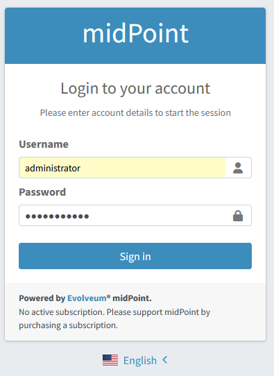

= Sample Installation of MidPoint and MidPoint Password Agent for Active Directory

This directory contains a simple midPoint instance configured to synchronize passwords with an Active Directory system.

== Prerequisites

. Docker Desktop
. Running Active Directory (AD) machine

=== How to run Active Directory

If necessary, the AD can be created by cloning https://github.com/splitbrain/vagrant-active-directory.git and running it by `vagrant up`.

Note that the process may take quite a long time and require a few reboots of the virtual machine.

After the installation, it should be possible to connect to the VM as described in https://github.com/splitbrain/vagrant-active-directory.

NOTE: If you'd like to use a different AD installation, please change the connection parameters in `pwd-agent-test-env/midpoint_server/container_files/mp-home/post-initial-objects/100-resource-ad.xml`

== MidPoint Startup

After AD machine is up and running, the you can start midPoint by running `docker compose up` in `pwd-agent-test-env` subdirectory.

NOTE: You may need to remove any pre-existing configurations by runing `docker compose down -v` before starting it up.

MidPoint will run at `localhost:8080`.

=== Checking that MidPoint Lives

1. Log into midPoint using a browser.
Credentials: `administrator` / `SUPER5ecr3t`.
+

2. Check that you see `administrator` and `jack` users there.
+
image::users.png[]

3. Check that `jack` has a single account (projection) on AD resource.
+
image::jack.png[]

=== Checking the REST Interface

1. Run `get-ad-resource-status.sh` and check that the AD resource is up (see `lastAvailabilityStatus`):
+
[source,json]
----
{
  "resource" : {
    "oid" : "baaad572-97d0-491e-9b4a-024633533778",
    "version" : "2",
    "name" : "Active Directory",
    "operationalState" : {
      "lastAvailabilityStatus" : "up",
      "message" : "Status set to UP because resource schema was successfully fetched",
      "timestamp" : "2026-05-25T15:05:00.422Z",
      "nodeId" : "DefaultNode"
    }
  }
}
----

2. Run `get-user-jack.sh` and check it has a single account represented by a `linkRef` value (but you already checked that in the GUI):
+
[source,json]
----
{
  "user" : {
    "oid" : "ad3fb4ef-49d7-464b-a4e5-f3f019b1dd11",
    "version" : "4",
    "name" : "jack",
    "linkRef" : {
      "oid" : "871c59db-b1dc-4d25-a801-7c60a2bf7597",
      "relation" : "org:default",
      "type" : "c:ShadowType"
    },
    "fullName" : "Jack Sparrow"
  }
}
----

=== Sending the Artificial Notification About a Password Change

Before installing the password agent, please try running `notify-password-change.sh`.
It will send out the following REST message (see `notify-password-change.json`), simulating the real change of a password on Active Directory.

NOTE: You can skip this step if you like to.
It is only to make sure everything works before installing the agent.

[source,json]
----
{
	"resourceObjectShadowChangeDescription": {
		"oldShadow": {
			"resourceRef": {
				"oid": "baaad572-97d0-491e-9b4a-024633533778",
				"type": "c:ResourceType"
			},
			"objectClass": "ri:user",
			"attributes": {
				"ri:sAMAccountName": "jack"
			}
		},
		"objectDelta": {
			"@ns": "http://prism.evolveum.com/xml/ns/public/types-3",
			"changeType": "modify",
			"objectType": "ShadowType",
			"itemDelta": {
				"modificationType": "replace",
				"path": "credentials/password/value",
				"value": "y0uR_P455woR*d"
			}
		}
	}
}
----

There should be no error message, and the `mail-notifications.txt` file should contain this:

----
# Here will come mail notifications
============================================
Mon May 25 15:26:50 UTC 2026
Message{to='[recipient@evolveum.com]', cc='[]', bcc='[]', subject='User password notification', contentType='null', body='Password for user jack is: y0uR_P455woR*d
----

== MidPoint Password Agent Installation

Now please log into the AD and install the agent as described link:../docs/administration/README.md[here].

Use the following parameters during installation:

- MidPoint URL: `http://192.168.56.1:8080/midpoint`
- Username: `ad-pwd-sync`
- Password: `T0pS3cr3t!`
- Resource OID: `baaad572-97d0-491e-9b4a-024633533778`

=== Testing the Password Change

In _Active Directory Users and Computers_ app, find the user _Jack Sparrow_ (`jack`) and reset his password to something complex like `Super5ecr3t123!` (to be accepted both by AD and midPoint password policies).
Observe that the change is propagated to midPoint.

In `listener.json` there should be records like these:

[source,jsonlines]
----
{"time": "2026-06-30T23:08:55.466210+00:00", "level": "info", "message": "PasswordChangeNotify: user=jack domain=example.local"}
{"time": "2026-06-30T23:08:55.477107+00:00", "level": "info", "message": "AES key loaded and unprotected with DPAPI"}
{"time": "2026-06-30T23:08:55.479509+00:00", "level": "info", "message": "Generated new file name '20260630_230855_83A52846CB0F4D1BA4437089FDB3F28B_v2.event'"}
{"time": "2026-06-30T23:08:55.479661+00:00", "level": "info", "message": "Creating queue staging file succeeded"}
{"time": "2026-06-30T23:08:55.479724+00:00", "level": "info", "message": "Write to queue staging file succeeded"}
{"time": "2026-06-30T23:08:55.480713+00:00", "level": "info", "message": "Move queue staging file to final destination succeeded"}
----

They indicate that the password change was successfully queued.

In `sender.json` there should be records like these:

[source,jsonlines]
----
{"time":"2026-06-30T23:08:55.499271+00:00","level":"info","message":"Found 20260630_230855_83A52846CB0F4D1BA4437089FDB3F28B_v2.event event file in queue directory"}
{"time":"2026-06-30T23:08:55.504130+00:00","level":"info","message":"Moved 20260630_230855_83A52846CB0F4D1BA4437089FDB3F28B_v2.event event file to processing directory"}
{"time":"2026-06-30T23:08:55.509099+00:00","level":"info","message":"Found 1 event file(s) to process"}
{"time":"2026-06-30T23:08:55.512071+00:00","level":"info","message":"Parsed: 20260630_230855_83A52846CB0F4D1BA4437089FDB3F28B_v2.event user=jack domain=example.local retryCount=0"}
{"time":"2026-06-30T23:08:55.512113+00:00","level":"info","message":"Processed: 20260630_230855_83A52846CB0F4D1BA4437089FDB3F28B_v2.event"}
{"time":"2026-06-30T23:08:55.684388+00:00","level":"info","message":"Password change forwarded for jack@example.local"}
{"time":"2026-06-30T23:08:55.685646+00:00","level":"info","message":"Deleted file C:\\ProgramData\\MidPoint Password Agent for Active Directory\\Data\\Queue\\processing\\20260630_230855_83A52846CB0F4D1BA4437089FDB3F28B_v2.event"}
----

In `midpoint.log` there should be no error message.

In `mail-notifications.txt` there should be a (dummy) notification about changed password.
It is here just for providing some visible effect.
In your deployments, you don't need to use such notifications.

[source]
----
============================================
Tue Jun 30 23:08:50 UTC 2026
Message{to='[recipient@evolveum.com]', cc='[]', bcc='[]', subject='User password notification', contentType='null', body='Password for user jack is: Super5ecr3t123!
No active subscription. Please support midPoint by purchasing a subscription.', attachmentsCount: 0
----
